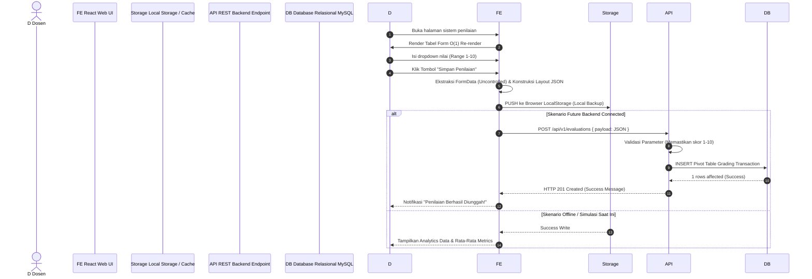

# System Design & Architecture (Dokumentasi System Analyst Ekstensif)

Dokumen ini adalah ekspansi dokumen arsitektur dan bisnis logic Sistem Penilaian Mahasiswa guna melengkapi portofolio System Analyst tingkat lanjut. Ini memuat Usecase, Sequence Diagram, Contract Interface, dan DDL relasional.

## 1. Use Case Diagram

Diagram ini memperlihatkan scope operasi aktor (`Dosen` dan backend hipotetikal) terhadap sistem penilaian.

```mermaid
usecase
    title Use Case: Sistem Penilaian Mahasiswa
    actor Dosen
    actor "REST API (Backend)" as B

    package "Aplikasi Penilaian (Frontend)" {
        usecase "Input Nilai Form (10 Mahasiswa, 4 Aspek)" as UC1
        usecase "Simpan Matriks Nilai" as UC2
        usecase "Lihat Histori Penilaian" as UC3
        usecase "Cetak Laporan / Unduh JSON" as UC4
        usecase "Lihat Kalkulasi Analitik (Rata-rata Aspek)" as UC5
    }

    Dosen --> UC1
    Dosen --> UC2
    Dosen --> UC3
    UC3 .> UC4 : <<extend>>
    UC3 .> UC5 : <<extend>>
    
    UC2 --> B : (Future) Sinkronisasi Database Pusat
```

## 2. Sequence Diagram (Alur Interaksi Aplikasi & API Hub)

Menjelaskan secara berurutan langkah demi langkah aplikasi dalam siklus penyetoran Evaluasi menuju Backend Server dan responnya.



## 3. Desain Kontrak API (OpenAPI 3.0 / Swagger Spec)

Sebagai seorang System Analyst, kita harus mendefinisikan API blueprint yang digunakan frontend agar Backend Developer mudah menyelaraskan logika. Di bawah ini adalah *specification endpoint* yang merepresentasikan *body* yang dikirim web page ke *server*.

```yaml
openapi: 3.0.3
info:
  title: API Grading Mahasiswa Terpadu
  version: 1.0.0
paths:
  /api/v1/evaluations:
    post:
      summary: Submit hasil penilaian kelas massal
      description: Endpoint yang akan membongkar payload nested JSON menjadi relasional untuk database
      requestBody:
        required: true
        content:
          application/json:
            schema:
              type: object
              properties:
                aspek_penilaian_1: 
                  $ref: '#/components/schemas/MatriksMahasiswa'
                aspek_penilaian_2: 
                  $ref: '#/components/schemas/MatriksMahasiswa'
                aspek_penilaian_3: 
                  $ref: '#/components/schemas/MatriksMahasiswa'
                aspek_penilaian_4: 
                  $ref: '#/components/schemas/MatriksMahasiswa'
      responses:
        '201':
          description: Data penilaian tersimpan
        '400':
          description: Validasi Gagal (Nilai di luar 1-10)

components:
  schemas:
    MatriksMahasiswa:
      type: object
      additionalProperties:
        type: integer
        minimum: 1
        maximum: 10
      example:
        mahasiswa_1: 8
        mahasiswa_2: 7
```

## 4. DDL Skema Fisik & Transformasi Relasional

Skema ini harus di- *execute* oleh Backend dan DBA untuk menampung JSON diatas (*Reference dari versi dokumentasi sebelumnya*).

```sql
CREATE TABLE T_Mahasiswa (
    id_mhs INT PRIMARY KEY,
    nama VARCHAR(100),
    nim VARCHAR(20) UNIQUE
);

CREATE TABLE T_Aspek (
    id_aspek INT PRIMARY KEY,
    deskripsi VARCHAR(255)
);

CREATE TABLE T_Penilaian (
    id_nilai BIGINT PRIMARY KEY AUTO_INCREMENT,
    id_mhs INT REFERENCES T_Mahasiswa(id_mhs),
    id_aspek INT REFERENCES T_Aspek(id_aspek),
    skor_nilai INT CHECK(skor_nilai BETWEEN 1 AND 10),
    created_at TIMESTAMP DEFAULT CURRENT_TIMESTAMP
);
```

Dengan desain Sistem Ekstensif ini (Usecase, Sequence, API Blueprint, dan DDL), kolaborasi di environment Enterprise atau Software House antar role *Frontend, Backend, Tester*, dan *Stakeholder* akan sangat terarah tanpa miskomunikasi.
